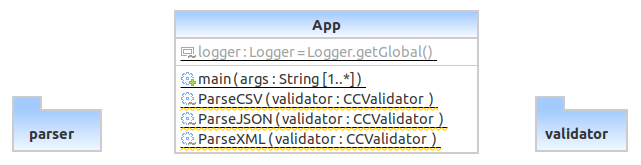
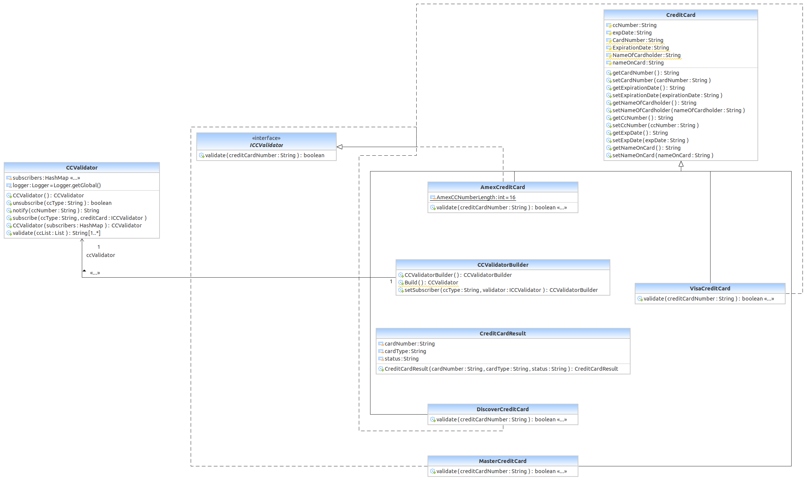
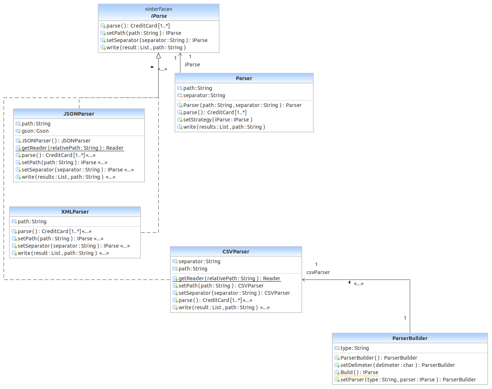

# Problem - Design a solution using object oriented design utilizing various GoF patterns.

Use case - Given a credit card record in various input format such as json, xml, csv, develop a solution to detect card type, and do validation if it is a valid credit card.

* Describe the problem trying to solve
    The primary problem is to solve automating validation of credit card records in various file formats such as json, xml, csv. 
* Secondary Problem faced:
    * Break original problem into sub-problem by design and create component such as following:
        Validation Component
        Parser Component
        Generic and concret credit card component
        Generic interface
        How to implement my solution such that it can be scaled.
    * The other problem I faced is to find a way to support various input sources that can be implemented without changing original source code yet open for extension as well as users should not be aware of internal details. Also to follow industry standard software design approach.

* Design Patterns used: I used both behavioural and creational design patterns, following are the design pattern used to solve this problem:
    * Creational Design Pattern
        * Builder Pattern : I used this pattern to implement credit card validator component.
    
    * Behavioral Design Pattern
        * Observer Pattern: This pattern is also used in implementing validator components. The idea is that various credit cards can be subscribed and unsubscribed to validator component. When the validator component receives a record to validate it should notify(publish) that record to all subscribed credit cards. The observer pattern helped to subscribe as many as credit cards we want.

        * Strategy Pattern: Parser component is implemented using this pattern. Why chose this pattern to implement it is because we might need to support some future credit card input source. What we need to do is to implement new strategy and set the strategy before parsing the input source.

        * Iterator Pattern: Parser component returns collection of parsed credit card record so we need to check record one by one so I used iterator pattern for this.

    * SOLID Principles:
        * Single Responsibility Principle: Implemented seperate credit card class for each credit card type such as AmexCreditCard, MasterCreditCard, VisaCreditCard, DiscoverCreditCard, which does only single responsibility such as validating if cards belong it.

* Consequences/Advantages:
    * Ease of extending the code for future enhancement such as adding new type of input source for credit card data as well as parser which can support new data source.
    * Builder pattern helped in avoiding long parameterized constructor definition, also provides more meaningful and user friendly way of constructing validator object.
    * Using observer pattern helped in implementing publish/subscribe model, which is very useful when we want to add more kind of credit card.
    * Strategy pattern helped in injecting/achieving concrete parser at runtime.
    * Iterator pattern helped in iterating collection of CreditCard records one by one.

	
    
## Class Diagram

### Main package

### Validator Package

### Parser Package
